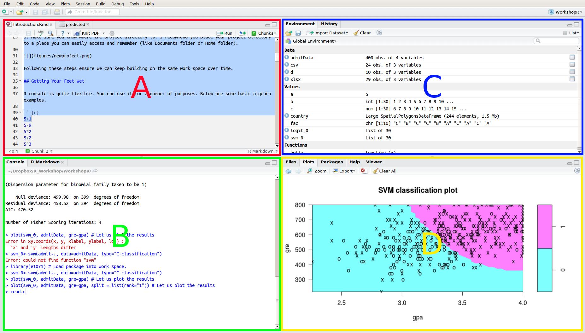
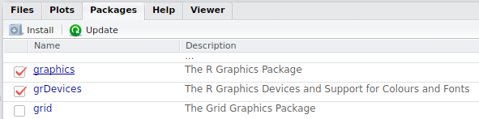
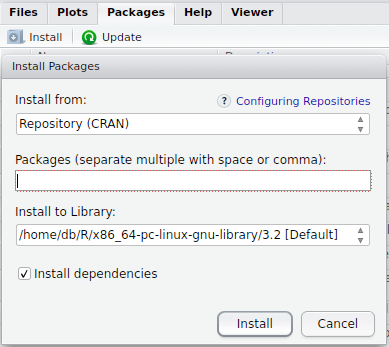

R's true power comes from packages available. As of 26^th^ of June 2017, [CRAN](https://cran.r-project.org/) includes 10923 packages. These packages enable the user to conduct a myriad of analysis, data mangling, and visualization tasks.

A Package, in simple terms, is a collection of functions, documentation, and in some cases data files. These are similar to libraries in other programing languages. **When loaded into memory**, they provide specific functionality, be it analysis, visualization, or reporting. 

R being open source enabled a great number of packages serving any function imaginable, making it one of the most popular tools for analytics. If a feature is missing, you can easily develop your own functions and bundle them into a package for others to use.

In this document we will go over the basics of package management in R.

## Basics in GUI

Before getting into the details of package management, let us learn how to obtain and activate a package. In this section I will use R Studio interface, follow the screen shots to follow along. Below is a screenshot of R Studio interface. Note the colorful capital letters. I will use those letters to refer to specific panes in the interface.



In D Pane, you will see a packages tab. If you click on it it will provide you with a list of all packages installed in your system (See Figure 2). If you want to load a specific package, simply click the check box next to its name. To unload it from the memory simply unclick the same.



If the package you need is not already installed in your system, you can easily obtain it from CRAN. Simply click on the install button on the tab bar and type the package name (See Figure 3).



## Basics in Command Line

Now I want to go over those same basics in the command line interface (CLI). I am doing this partly to demonstrate to you how much easier it is to communicate about commands as opposed to GUI. Describing what we are doing in a GUI requires pictures, lots of references to on screen elements and is still not precise. Explaining what is going on in the CLI is much easier.

Before getting into the details of package management, let us learn how to obtain and activate a package.

If the package you need is not already installed in your system, you can easily obtain it from CRAN via install.packages() function. Below you can see the command to install the plm package, a set of functions to carry out traditional econometric analysis. 

```{r, eval=F}
install.packages("plm")  # Notice the quotes around package name
```

Pretty soon the package will be installed. Installing a package does not mean it is ready to use. You also have to activate it. For this purpose you can use the library() command.

```{r}
library(plm) # Notice the lack of quotes around the package name
```

Now you know how to obtain and activate a package. So in the future when I say we will use a specific package for an analysis, you will be able to easily obtain said packages.

You most probably won't need this, still it is good to know. To de-activate a package, we use the detach() function. The parameters of this command is a bit more involved than the first two.

```{r}
# Notice the package: prepended to the package name
detach("package:plm", unload = TRUE) 
```

## Details

If you want to get a list of all the packages that are currently loaded in the memory (activated) use the .packages() command.

```{r}
(.packages()) # Notice the parantheses
```

If you want to get a list of all packages installed in the system use the parameter. I am omitting the output since I have about 150 packages installed.

```{r, eval=FALSE}
.packages(all.available = T)
```

# How to find out about packages?

If you want to find packages to carry out the tasks you have at hand, the first place to start would be either [Comprehensive R Archive Network (CRAN)](https://cran.r-project.org/web/packages/) or (for a better interface) [R Forge.](https://r-forge.r-project.org/) [R site search](http://search.r-project.org) (also available with command RSiteSearch()) provides a great search engine for documentation. [R seek](http://rseek.org/) is a great search engine dedicated to scanning R related sources. Of course you can always use google as well but the letter R is a bit ambiguous in some cases. 

R frequently offers a number of packages that serves similar purposes (lme4 and nlme for mixed models for example). There are subtle differences between the packages and picking the right tool for the task can save you a lot of time. I often find myself using documentation from CRAN pages of the packages before I settle for the one I want to use. I frequently spend more time browsing documentation, than on actual analysis. A careful reading of the documentation will allow you to better understand the options available to you.

CRAN is not only a repository for the code, but also for the documentation. Here is the [plm package](https://cran.r-project.org/web/packages/plm/) page for example. Beyond reference manuals and other documentation, R packages often come with vignettes and tutorials. These are often like quick start guides to analysis. 

If you want to search a certain word in installed packages' documentation, you can always use ?? or help.search()

```{r}
??mixed
help.search("mixed model")
```

## Commonly Used Packages

### Data Manipulation

#### data.table

*data.table* package is a replacement of the data.frame data structure. It is not a drop-in replacement and is not fully compatible with all data.frame functionality. So you need to be careful when you use it. I would recommend not mixing data.frames and data.tables in an analysis (to prevent confusion). Choose one and stick to it if possible.

It replaces data.frame with a data structure that is more efficient. Meaning it is faster when accessing and writing into data.tables.

It also comes with additional functionality that makes subsetting/aggregating a breeze.

#### dplyr

*dplyr* is a package that adds additional functions to efficiently manipulate data (subsetting/aggregate, etc.). It still uses data.frames so you do not have compatibility issues in your code. 

Another benefit is, it can directly work with data stored in databases. So you can select, filter data from a database and use it in R.

### Statistics

R *base* package (that comes loaded) includes your basic statistics such as Multiple Regressions and Generalized Linear Models.

#### Panel Data Econometrics

Your traditional fixed effects / random effects econometric models are covered in *plm* package.

#### Hierarchical/Mixed Effects Models

Two packages, nlme and lme4 handle this bit. The development on nlme has slowed down a bit, yet it incorporates functionality to model autoregressive correlation structures, weighting to take care of heteroskedasticity and so on.  Both packages have unique strengths, you need to read the documentation to see which one fits your needs best.

### Machine Learning

#### Caret
*caret* package provides a nice set of functions for almost all predictive analytics needs. It is discussed in deeper detail later in semester. Once you install *caret*, the other packages listed below will automatically installed.

#### Classifiers (KNN, LVQ)

K Nearest Neighbor matching and Learning Vector Quantization and more are available through *class* package.


#### Support Vector Machines

*kernlab*, *e1071* packages are two among many packages that provide this functionality.

#### Clustering

*base* package has functionality to enable basic clustering techniques like K means (kmeans()), or hierarchical (hclust()) clustering.

For model based clustering there is the *mclust* package.

#### Neural Networks

*neuralnet* package as well as others provide NN functionality.

------

 How I Learned to Stop Worrying and Love the R Console by [Irfan E Kanat](http://irfankanat.com) is licensed under a [Creative Commons Attribution 4.0 International License](http://creativecommons.org/licenses/by/4.0/). Based on a work at [http://github.com/iekanat/rworkshop](http://github.com/iekanat/rworkshop).