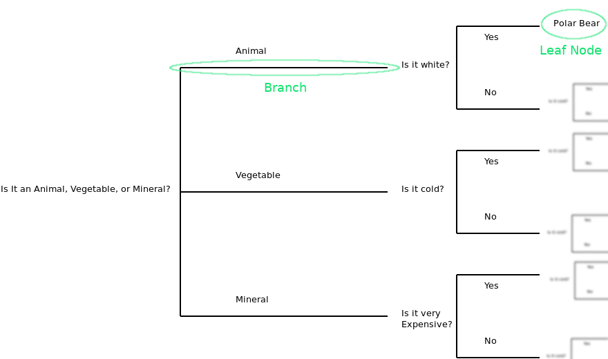

```{r setup, include=F}
library(rpart) # For trees
library(rpart.plot) # For drawing nicer trees
set.seed(256) # Reproducibility
# CERTAIN OPERATIONS HERE ARE A BIT RANDOM
# DEPENDING ON THE SEED AND THE ORDER OF EXECUTION RESULTS CAN CHANGE A BIT
```

## Regression Trees

The multiple regression is great if you can capture the data generating mechanism with a global model. A global model applies to the whole of the data. If you believe certain bits of data are generated with a different process (e.g. Luxury condos have a different slope for square footage), the model starts getting complicated. You would have to introduce interaction terms to take into account these differences. For a limited number of variables this is easy to do, it gets complicated real fast once the number of variables start growing. If you are not married to the idea of a global model, and are more interested in prediction then you can use a regression tree.

You can think of it as partitioning the dataset into smaller subsets. Smaller, well behaved subsets for which we can fit simple models. Once you start going in this direction, you can see that the partitioning is similar to the [20 questions game](http://www.20q.net/). The questions can be thought of as branches in a tree. Each question determines which branch you will be following. By following the branches, you will eventually come to a leaf. For the leaf (subset of data) we will fit a simple model and get a result.



Obviously the order of questions matter. If you were to ask "Is it white" as the first question the resulting split may have been much less effective than asking if it is an animal or a vegetable. What the algorithm does is find the most significant predictor for a split at each branch and split the data based on that predictor. So you can gather the importance of variables by their position on the tree.

A regression tree works in a similar fashion, each question would be about the value of an independent variable. Based on values of independent values we will drill down further and create a manageable subset for which a simple model (such as the mean) would fit.

There are certain advantages to a regression tree model. It is often easier for humans to make sense of than an equivalent regression model. Trees may fit certain datasets better depending on how the mechanism creating the data works. The algorithms used are computationally simple and efficient. 

While we discuss Regression Trees in two separate activities in continuous and categorical models, there is nothing inherent in the model that makes it one or the other. Regression trees can be used for either kind of analysis with minimal changes.

## UCLA Housing Data

We will be using the UCLA housing data for this exercise. The data can be found among [Kaggle datasets online](https://www.kaggle.com/apratim87/housingdata).

Import the dataset.

```{r}
housing <- read.csv("data/housingdata.csv")
```

The data is at town level.

CRIM: Crime Rate
ZN: Proportion of residential land zoned
INDUS: Non-retail business acres per town
CHAS: River boundary
NOX: Nitric oxide concentration
RM: Average number of rooms
AGE: Proportion of owner occupied units built before 1940
DIS: Distance to five employment centres
RAD: Accessibility to highway
TAX: Property tax
PTRATIO: Pupil-Teacher Ratio
B: Proportion of blacks
LSTAT: proportion of lower status
MEDV: Median value of homes

## Analysis

First order of business is to establish the partitioning scheme. We will use **rpart** function from **rpart** package.

```{r}
housing_rt_0 <- rpart(MEDV ~ CRIM + DIS + TAX, data = housing, method = "anova")
```

I won't go over the parameters of this function call, as most of it should be obvious by now. The only parameter that may be unknown is **method = "anova"**, this is how we tell rpart that we aim to model a continuous variable. If you are curious read the manual for rpart (?rpart).

If we were to call summary over housing_rt_0 we would get a very verbose description of a regression tree. ***Try it on your own and inspect the output.***

Let us look at our tree.

```{r}
rpart.plot(housing_rt_0)
```

You can get at how important each variable is by looking at where and how often you see it in the tree. A simpler way is to ask R to show it to you.

```{r}
housing_rt_0$variable.importance
```

Here is a simple exercise, try and fit a more complex tree by including more variables. See how that changes the tree that is fitted.

## Pruning the Tree

What I hope you can quickly see upon inspection is that such a tree would be quite large. (1) It would be more complex, so it is not the easiest to understand or to explain. (2) It is most likely overfitted. That means while it would explain this dataset very well but, it will not be as useful in explaining future datasets.

We need to prune the tree for it to be useful beyond this dataset. For each branch we add, we are adding complexity to the model. The idea is to stop at the point where the added complexity does not justify the added explanatory power. We determine the number of splits using a cp (complexity parameter) table such as the one below:

```{r}
summary(housing_rt_0, "cp")
```

rel error is ($1-R^2$) the ratio of unexplained variance. 

xerror is cross validation error. 

xstd is cross validation standard deviation. 

Ideally you would like errors to be small. We will learn more about cross-validation later but, for now think of it as how well will this model work on other datasets.

There are a number of ways to determine the number of splits. You need to make an honest judgment call on what works best in the given circumstances. 

A simple approach is to select the split that minimizes the cross validation error. Which would mean having 15 splits (xerror = `r min(housing_rt_0$cp[(length(housing_rt_0$cp)/5*3+1):(length(housing_rt_0$cp)/5*4)])`). 

An argument can be made that the trees that are within the error margin of this said tree are doing just as good a job with fewer terms. So choosing them is another option. Then we want to use the smallest tree that is one standard deviation from the tree with smallest cross validation error (meaning xerror is less than 0.6375 + 0.0602 = `r .6375+.0602`). Gosh that is a mouthful. Here is a simpler way: Inspect the plot below. The top axis is the number of splits (specified with upper = "splits" argument). X axis is complexity parameter, and Y axis is the cross validation error. The dashed line is 1 xstd away from minimum xerror. You want the split scheme that gives you the smallest tree while still being in the error margin. That would be the tree with 7 splits.

```{r}
plotcp(housing_rt_0, upper = "splits")
```

Now you can use either the cp of the said model to prune the tree.

```{r}
# Prune the Tree To have 7 Splits
housing_rt_0pr <- prune(housing_rt_0, cp = 0.0209)
rpart.plot(housing_rt_0pr)
```

Now that is more like it.

Here is another simple exercise: Prune the more complex tree you fit earlier.
 
## Predicting with A Regression Tree

The main reason you want to have a regression tree is to be able to predict things based on the tree.

Remember this tree was fit to predict median value of homes based on Distance, Crime and Tax rate...

Let us say that we want to predict the median value of a town with CRIM = 1.05393, DIS = 4.4986, TAX = 307. Look at that tree above.

Let us follow the tree down to a leaf:

1. The first question is if the tax is higher than 417. Since the answer is no, we go right. 
2. The second question is if the tax is higher than 268. The answer is yes, we go left.
3. The third question is if the distance is less than 1.8. The answer is no, we go right.
4. The fourth question is if the distance is greater than 2.1. The answer is yes, we go left. 

Which puts us at a median value of 24. 45% of the towns are in this subset.

This is fine to do on a single town. What if you were given a whole new dataset and asked to predict median value?

We can use the predict function.

```{r}
# Let us create a new dataset to predict
newHousing <- data.frame(CRIM = c(1.05393, 4.1), DIS = c(4.4986, 1.2), TAX = c(307, 100))
predict(housing_rt_0pr, newHousing)
```

Predict function takes a model and a new dataset and returns estimated dependent variable values for the independent variables given.

Here is a simple exercise: If you wanted to store the predicted MEDV values in newHousing data frame. How would you do that? 

Here is another simple exercise: Predict the MEDV value for 17th throught to 32nd observations in the housing data (using predict function obviously).


# Exercises

1 - Try and fit a more complex tree by including more variables. See how that changes the tree that is fitted.

The answer will change based on what you included... Here is mine:

```{r}
housing_rt_1 <- rpart(MEDV ~ RM + NOX + CRIM + INDUS + DIS + TAX, data = housing, method = "anova")
rpart.plot(housing_rt_1)
```

Looks good to me. To be honest, I fit this model twice once with all variables, and then I checked the most important variables using $variable.importance and only included those that were important.

2 - Prune the more complex tree you fit earlier.

Again, the results will depend on what kind of tree you fit earlier.

```{r}
plotcp(housing_rt_1, upper = "splits")
```

Plot indicates 4 splits is the way to go. CP for this split is 0.037.

```{r}
housing_rt_1pr <- prune(housing_rt_1, cp = .037)
```

We can now look at what we have.

```{r}
rpart.plot(housing_rt_1pr)
```

3 - if you wanted to store the predicted MEDV values in newHousing data frame. How would you do that? 

```{r}
newHousing$predMedv <- predict(housing_rt_0pr, newHousing)
```

4 - Predict the MEDV value for 17th throught to 32nd observations in the housing data (using predict function obviously).

```{r}
predict(housing_rt_0pr, housing[17:32,])
```