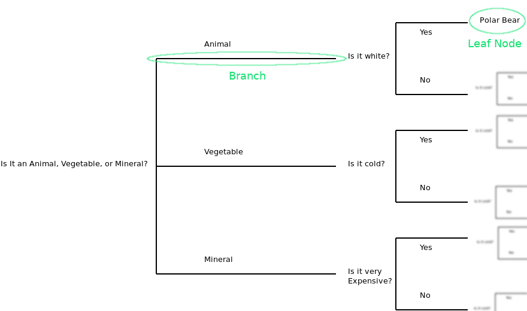

```{r setup, include=F}
library(rpart) # For trees
library(rpart.plot) # For drawing nicer trees
set.seed(512) # Reproducibility
```

# Decision Trees

You may remember regression trees from the previous module, decision trees are the same idea applied to categorical dependent variables. The structure of this activity will be very similar to regression trees.

It is again helpful to remember the 20 questions game, especially more so since the dependent variable in a 20 questions game is also categorical. Each question determines which branch you will be following. By following the branches, you will eventually come to a result. The results are the leaves of the tree...



Once again, the order of questions matter. If you were to ask "Is it white" as the first question the resulting split may have been much less effective than asking if it is an animal or a vegetable. What the algorithm does is find the most significant predictor for a split at each branch and split the data based on that predictor. So you can gather the importance of variables by their position on the tree.

Everything we said about the benefits of a regression tree stand for decision trees as well.

Let us see how this works over an example:

## EPA Vehicle Data

We will be using the EPA vehicle data for this exercise. The data can be found in [EPA datasets online](https://www.fueleconomy.gov/feg/download.shtml). I have taken the liberty of reducing the number of variables and observations. So if you independently download the dataset you might find more variables.

Import the dataset.

```{r}
vehicles <- read.csv("data/vehiclesSub.csv")
```

The variables we care about are: 

VClass: Vehicle class, our dependent variable. 
barrels08: Yearly fuel consumption in barrels.
city08: City MPG
highway08: Highway MPG
comb08: Combined MGP
co2TailpipeGpm: Tailpipe CO2 in grams/mile
cylinders: Engine cylinders.
displ: Engine displacement in liters.
drive: Drive axle type
fuelCost08: Annual fuel cost in dollars.
fuelType: Fuel type.
id: Record ID.
make: Manufacturer.
model: Model name.
pv2: 2 door passenger volume.
pv4: 4 door passenger volume.
trany: Transmission.
year: Year.


## Analysis

First order of business is to establish the partitioning scheme. We will use **rpart** function from **rpart** package.

```{r}
vehicles_dt_0 <- rpart(VClass ~ year + comb08 + displ, data = vehicles, method = "class")
```

I won't go over the parameters of this function call, as most of it should be obvious by now. The only parameter that may be unknown is **method = "class"**, this is how we tell rpart that we aim to model a categorical variable. If you are curious read the manual for rpart (?rpart).

If we were to call summary over housing_rt_0 we would get a very verbose description of a regression tree. ***Try it on your own and inspect the output.***

Let us look at our tree.

```{r}
rpart.plot(vehicles_dt_0)
```

Each box in the diagram contains three lines:

* First line is the predicted class type.
* Second line is the predicted probabilities of the class membership.
* Third line is the percentage of observations in this group.

Here is a simple exercise, try and fit a more complex tree by including more variables. See how that changes the tree that is fitted.

### Pruning the Tree

Once more, we need to prune the tree for it to be useful beyond this dataset. We determine the number of splits using a cp (complexity parameter) table such as the one below:

```{r}
summary(vehicles_dt_0, "cp")
```

rel error is ($1-R^2$) the ratio of unexplained variance. 

xerror is cross validation error. 

xstd is cross validation standard deviation. 

Ideally you would like errors to be small. We will learn more about cross-validation later but, for now think of it as how well will this model work on other datasets.

A simple approach is to select the split that minimizes the cross validation error. Which would mean having 5 splits (xerror = 0.5792). 

The graphical approach also produces similar results. So we are fine using 5 splits.

```{r}
plotcp(vehicles_dt_0, upper = "splits")
```

We need to give the prune function the desired cp value to prune the tree accordingly.

```{r}
# Prune the Tree To have 5 Splits
vehicles_dt_0pr <- prune(vehicles_dt_0, cp = 0.026)
rpart.plot(vehicles_dt_0pr)
```

Now that is more like it.

Here is another simple exercise: Prune the more complex tree you fit earlier.

## Predicting with A Regression Tree

The main reason you want to have a regression tree is to be able to predict things based on the tree.

Remember this tree was fit to predict type of vehicles based on displacement, year, and fuel consumption.

Let us say that we want to predict the type of a vehicle with comb08 = 15, displ = 3.9, and year = 2000.

Let us follow the tree down to a leaf:

1. The first question is if the fuel consumption (comb08) is less than 18. Since the answer is yes, we go left. 
2. The second question is if the year is greater than or equal to 1995. The answer is yes, we go left.
3. The third question is ifthe fuel consumption (comb08) is greater than or equal to 14. The answer is yes, we go right.

Which classifies the vehicle as a Standard Pickup Truck. Which is correct (check out 111th observation).

If you need to predict a whole set of vehicles, you can use the predict function.

```{r}
# Let us create a new dataset to predict
# Rather than creating one, I will use a subset to predict
newVehicles <- vehicles[c(111, 222, 333, 444, 555),]
predict(vehicles_dt_0pr, newVehicles)
```

Predict function took a model and a new dataset and returned estimated membership probabilities.

Looking at these results, first observation (111) has a 5% probability of being a minivan, a 21% probability of being a subcompact car, and a 73% probability of being a pickup truck.

You can also get predicted classes if you so choose.

```{r}
predict(vehicles_dt_0pr, newVehicles, type="class")
```

Let us compare the predictions to actual values.

```{r}
newVehicles["VClass"]
```

You can see that the model predicted all but the fourth observation right.

Here is a simple exercise, try and predict classes for 112th, 223th, 334th and 556th observations using your own model.

# Exercises


1 - Try and fit a more complex tree by including more variables. See how that changes the tree that is fitted.

The answer will change based on what you included... Here is mine:

```{r}
vehicles_dt_1 <- rpart(VClass ~ year + comb08 + displ + cylinders + drive, data = vehicles, method = "class")
rpart.plot(vehicles_dt_1)
```

2 - Here is another simple exercise: Prune the more complex tree you fit earlier.

The exact cut off and splits will depend on the model you fit. For this model it is already as good as it gets at 4 splits.

```{r}
plotcp(vehicles_dt_1, upper = "splits")
```

3 - Here is a simple exercise, try and predict classes for 112th, 223th, 334th and 556th observations.

```{r}
newVehicles2 <- vehicles[c(112, 223, 334, 445, 556),]
predict(vehicles_dt_1, newVehicles2, type = "class")
```

Above are the predicted class, below are the actual.

```{r}
newVehicles2[,"VClass"]
```

The model was wrong about the third observation (predicted a Minivan where the vehicle was a subcompact car).